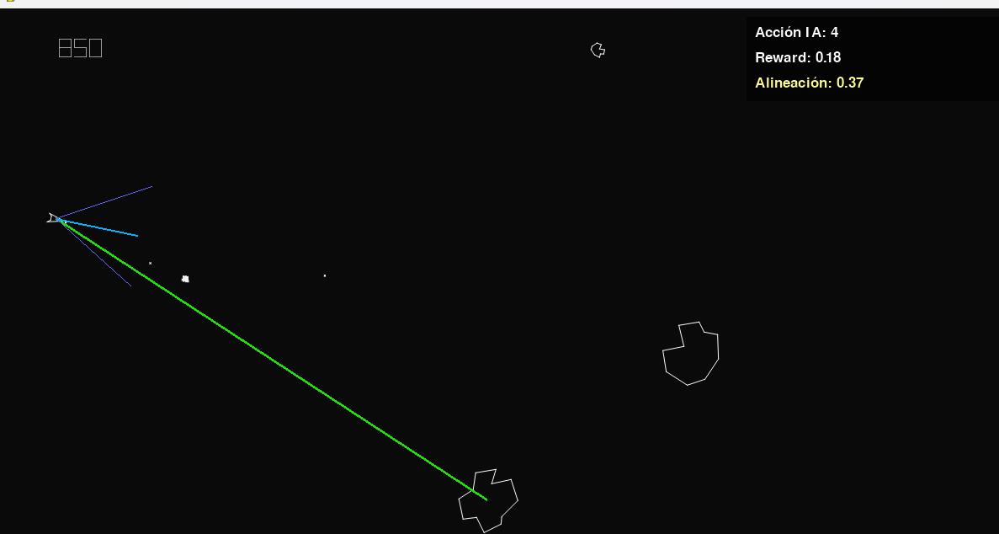

# Atari Asteroids with AI-DQN

An AI that learns to play the classic Atari *Asteroids* arcade game through neuroevolution, using Deep-Q learning algorithm.



> IA learning Framework by Jeremi A. & Alexis F. Ported to Python 3 by Francisco Sanchez Arroyo. Based on the original work *Pythentic Asteroids* by Nick Redshaw

> [!IMPORTANT]
> Install PyGame, Numpy and Torch libraries
```bash
    pip install pygame numpy torch
```

## Start leaning
`python trainDQN.py`   
